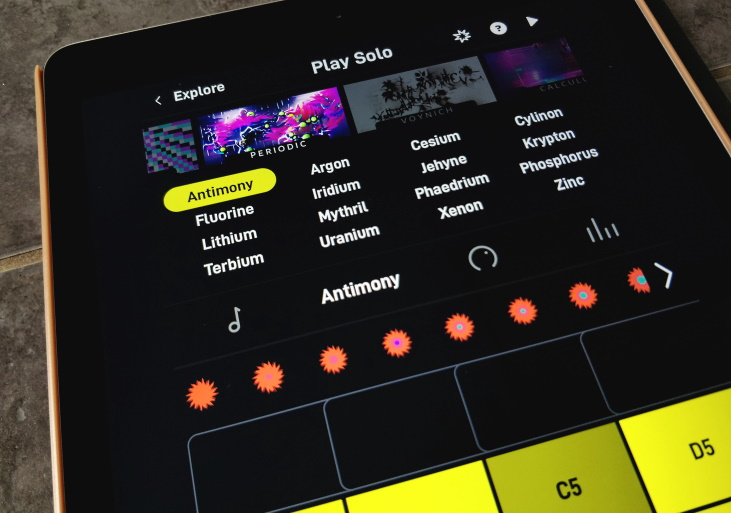
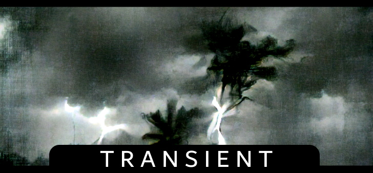

```
   ▄████████ ████████▄   ███    █▄   ▄██████▄  ███▄▄▄▄      ▄█   ▄█▄    ▄████████    ▄████████ 
  ███    ███ ███    ███  ███    ███ ███    ███ ███▀▀▀██▄   ███ ▄███▀   ███    ███   ███    ███ 
  ███    █▀  ███    ███  ███    ███ ███    ███ ███   ███   ███▐██▀     ███    █▀    ███    ███ 
  ███        ███    ███  ███    ███ ███    ███ ███   ███  ▄█████▀     ▄███▄▄▄      ▄███▄▄▄▄██▀ 
 ███████████ ███    ███  ███    ███ ███    ███ ███   ███ ▀▀█████▄    ▀▀███▀▀▀     ▀▀███▀▀▀▀▀   
         ███ ███    ███  ███    ███ ███    ███ ███   ███   ███▐██▄     ███    █▄  ▀███████████ 
   ▄█    ███ ███  ▀ ███  ███    ███ ███    ███ ███   ███   ███ ▀███▄   ███    ███   ███    ███ 
 ▄████████▀   ▀██████▀▄█ ████████▀   ▀██████▀   ▀█   █▀    ███   ▀█▀   ██████████   ███    ███ 
 Experimental Endlesss Soundpack Anarchy Engine            ▀  ishani | von | 2021   ███    ███
```

**ARCHIVAL NOTICE - since Endlesss changed how presets were installed in versions beyond 1.3.x and in doint so made it significantly more annoying to patch new ones in, combined with the dissolution of the company in 2024, this tool is now considered mothballed and obsolete.**

<br>

__Squonker__ is a tool for building and installing your own custom Endlesss instruments.



Parsing simple JSON-based _Audio Design_ files, __Squonker__ compiles your samples into lean, well-organised instrument packs, with direct injection into both (jailbroken) iOS and Studio installs for _rapid_ testing and iteration. 

```json5
{
    "author": "ishaniii",                                // it's a me
    "notes":
    [
        {
            "directory":    "bass_hierophant",           // where the samples live
            "name":         "Hierophant",                // name displayed in Endlesss
            "template":     "BassBasic",                 // instrument macro / preset template
            "note":         "welcome to the underworld", // a silly message nobody sees
            "volume_boost": 3.0,                         // give my samples a bit of a db boost
            "mods":
            [                                            // changes to make to the macro defaults
                {                                        // loaded from "BassBasic"
                    "preset" : "Xerces",                 // for the Xerces instrument .. 
                    "overrides":
                    [                                    // ... go set Level to 0.85 by default
                        { "macro" : "Level", "override" : 0.85 }
                    ]
                }
            ]
        }
    ],
    "drumkits":
    [
         // ... 
    ]
}
```

Sample processing takes your original WAV inputs and produces high-quality OGGs ready for ingestion by Endlesss, with post-processing options such as pack-wide volume changes (_and technically anything else that FFMPEG supports..._)

WAV loop metadata is supported so the sampler `loopStart`/`loopLength` values can be computed for you automatically ( as best as possible, given `loopLength`'s slightly unusual implementation in Endlesss )

<br>

With a single command ...

`./squonker compile -d squad.examples --ios --osx`

... __Squonker__ will process and deploy all the defined instruments into a configured iOS device and local Studio install.

Fill your Endlesss install with your own sounds!


<br><br>

---
# Requirements

## FFMPEG

__Squonker__ uses FFMPEG for sample conversion & post-processing, it needs to be available on your system. 

For Windows, you can grab a snapshot from [gyan.dev](https://www.gyan.dev/ffmpeg/builds/ffmpeg-git-essentials.7z) and put `ffmpeg.exe` next to __Squonker__ (or in your PATH)

For Mac, you could snag a snapshot from [evermeet.cx](https://evermeet.cx/ffmpeg/) or if you use [Homebrew](https://formulae.brew.sh/formula/ffmpeg), simply `brew install ffmpeg`

For Linux, you already know what to do, I won't patronise you.

<br>

## Pre-Built Binaries

__Squonker__ builds are available from the [Releases](https://github.com/Unbundlesss/squonker/releases) page. Each package contains executables for Windows, OSX and Linux. 

If you're a Go user, you can just `go build` and brew your own. __Squonker__ is currently built with go 1.17

<br>

---
# Quickstart

Unpack a release to a directory of your choice.

Run `squonker` with no arguments to see a list of all the options available. Run `squonker <cmd> --help` to see the options available for each command verb.

If you want to prep your iOS device for deployment, scroll down to the [iOS](#ios) section.

Build and deploy the demo pack with 

`./squonker compile -d squad.examples`

.. adding `--ios` to send it to your iOS device at the same time or `--osx` to target your local Studio install.

<br>

---
# Usage

__Squonker__ reads in a JSON *design* file that lays out how to build your soundpacks. Each design file can contain multiple soundpacks. The directory that contains both the design and all the input data is collectively referred to as a __SQUAD__, _Squonker Audio Design_.

Check the provided `squad.examples/design.json` to see how they are structured.

```json5
{
    "author": "ishaniii",                                // it's a me
    "notes":
    [
        {
            "directory":    "bass_hierophant",           // where the samples live
            "name":         "Hierophant",                // name displayed in Endlesss
            "template":     "BassBasic",                 // instrument macro / preset template
            "note":         "welcome to the underworld", // a silly message nobody sees
            "volume_boost": 3.0,                         // give my samples a bit of a db boost
            "mods":
            [                                            // changes to make to the macro defaults
                {                                        // loaded from "BassBasic"
                    "preset" : "Xerces",                 // for the Xerces instrument .. 
                    "overrides":
                    [                                    // ... go set Level to 0.85 by default
                        { "macro" : "Level", "override" : 0.85 }
                    ]
                }
            ]
        }
    ],
    "drumkits":
    [
         // ... 
    ]
}
```

Each entry declares where to find samples, names for the resulting packs, default values and modifications to apply. 

The layout of data and their definition in the JSON is slightly different between Notes and Drumkits. Note that when we refer to *Notes*, we also mean *Bass* as they function the same, just end up in a different place in the Endlesss UI.

<br> 

#### __Notes__ (including Bass notes)

A note instrument is built from a single sample, usually recorded at C3 (although fine-tuning can be applied in the template)

```
├── my_notes_soundpack                              <- "directory" in the JSON
    ├── Foo                                         <- the name of the instrument as it will appear in Endlesss
    |   └── recorded_toilet_flush_final.wav         <- the WAV input file; name is not important
    ├── Bar
    |   └── moog_boogie_C3.wav
    |
```
... With the name of the subdirectory defining the name of the resulting instrument. The WAV sample will be processed into `<instrument_name>.ogg` - which means you are welcome to chop and change the source WAV file names as you please, overwriting any already deployed version will not leave old OGG files lying about.

<br> 

#### __Drumkits__

A drumkit has 16 samples per instrument. Here's what they look like in the JSON

```json5
        {
            "directory": "drumkit_transient",
            "name": "Transient",
            "template": "trans-hp",                 // the default template to use for all; but can be 
                                                    //                  overridden on a per-preset basis
            "volume_boost": 6.0,                    
            "presets":                              // this is where things differ from Notes
            [                                       // each instrument gets its own entry under "presets"
                {
                    "name": "Fault",                // the name of the instrument as it will appear in Endlesss
                    "directory": "Kit1",            // the name of the subdirectory where the samples live
                    "note": "glitchy crunchers",    // silly message as per
                    "overrides":                    // same overrides system as Notes
                    [
                        { "macro" : "level", "override" : 0.75 },
                        { "macro" : "highpass", "override" : 0.05 }
                    ]
                }
            ]
        }
```

The arrangement of files on disk:

```
├── drumkit_transient                               <- "directory" in the JSON
    ├── Kit1                                        <- "presets" > "directory" in the JSON
    |   ├── kick1.wav                                       note it doesn't take the name of the directory
    |   ├── explosion.wav                                   for the instrument, it uses the one defined in 
    |   ├── kick3.wav                                       the JSON
    |   .. to 16
    |
    ├── FieldRecording2
    |   ├── horse.wav                               <- 16x WAV samples for each drum pad
    |   ├── horse_final.wav
    |   ├── horse_final_final.wav
    |   .. to 16
    |
```
In this case, the directory name is not used; instead assume that it can be more descriptive or contextful for where the samples came from. Inside the *design* JSON we then map directories to instrument names

### Advanced Fun

At the top of the design JSON you might notice

```json5
    "iconmap" : [
        { "svg" : "ElectroKick"   , "regex" : [ "EKick." ]      },
        { "svg" : "Rim"           , "regex" : [ "Rim." ]        },
        { "svg" : "Snare"         , "regex" : [ "Snare." ]      },
        { "svg" : "FloorTom"      , "regex" : [ "" ]            },
        { "svg" : "MidTom"        , "regex" : [ "Tom." ]        },
        { "svg" : "LowTom"        , "regex" : [ "" ]            },
        { "svg" : "Zap"           , "regex" : [ "" ]            },
        { "svg" : "Burst"         , "regex" : [ "FX." ]         },
        { "svg" : "Clap"          , "regex" : [ "Clap." ]       },
        { "svg" : "Cowbell"       , "regex" : [ "" ]            },
        { "svg" : "Crash"         , "regex" : [ "Crash." ]      },
        { "svg" : "Shaker"        , "regex" : [ "" ]            },
        { "svg" : "ClosedHH"      , "regex" : [ "CHat." ]       },
        { "svg" : "OpenHH"        , "regex" : [ "OHat." ]       },
        { "svg" : "Kick"          , "regex" : [ "Kick." ]       }
    ],
```

This provides a way to set the drum kit UI icons automatically based on filename. If your drum sample is called (say) "3.Kick.Woof.wav", then the icon will be set to "Kick". "Rim.Horse.wav" will be "Rim" and so on. You can add your own search terms to the regex array - confusingly it isn't actually a regex. sorry. I'll fix that one day; it's just looking for those words in the filename.

<br>

### __Soundpack Compilation__

`squonker compile -d <root-directory-of-your-designs>`

will produce all defined soundpack instruments into the `/output` directory. If you have a lot of packs in a single design, you can also specify a single pack to compile by

`squonker compile -d <root-directory-of-your-designs> -p <just-compile-this-named-pack>`

The `compile` command produces generated instruments, arranged by pack name, in the root `/output` folder. When deploying data to devices or local installs, __Squonker__ uses this `/output` folder as its working copy. 

If you've already read up the iOS deployment options below, note that you can add `--ios` to the compile command to have it automatically deploy all compiled packs to the iOS device as they are built. `--osx` will do the same for the local Studio install. Eventually, `--win` will do what you expect.

<br>

### __Soundpack Thumbnails__

To add your own custom pack thumbnail to Endlesss' UI, create a `728`x`338` JPEG file and save it in

`squad.<Name>/images/<pack_name>_2x.jpg`

eg. `squad.examples/images/Transient_2x.jpg`



During compilation, these will be moved to `/output` and are picked up by the various `###-deploy` commands, whereupon they are squirted into the Endlesss app container. Saucy.

There is a simple frame template in `/dox/example_artwork_overlay.png` (existing artwork uses the [Dubai Font](https://dubaifont.com/) for the title text)

<br><br>

----
# Deploying to Endlesss Studio (OSX)

Support is still "in testing" but you can push named soundpacks to your local Studio install with 

`squonker osx-deploy -p <packname>`

If soundpacks were compiled with custom thumbnail images, you must run __Squonker__ as root to get it to install the thumbnail directly into the Endlesss app. eg.

`sudo squonker osx-deploy -p <packname>`

**NOTE!** when running as root, squonker *only* deploys the images -- to avoid writing other files elsewhere with annoying root-level permissions. I recommend you run it without `sudo` once to deploy the instruments and then once to install the images. You only need to re-run it with `sudo` if you change thumbnails.

<br><br>

----
# Jailbroken iOS Hacking

<a name="ios"></a>

To begin using the iOS access, ensure your device is jailbroken (we recommend [checkra1n](https://checkra.in/), but don't blame me if you brick your Apple gear)

Install `Cydia` and then the `Filza File Manager`. Filza will let you start a WebDAV server to access the files on your iOS device, which __Squonker__ can then interact with.

To begin, run 

`squonker ios-discover <ip-of-your-ios-thing>`

This will go find where Endlesss is deployed and store the GUIDs locally for future use.

**NOTE!** If you install a new version of Endlesss, you will have to re-run `ios-discover` to get the new GUIDs.

<br>

## iOS Functionality

### Deploy A Pack
Given the name of directory in `/output`, this will push the files onto the iOS device, optionally doing a purge of the named presets as it goes (`--clean`); `clean` is not normally required, as __Squonker__ compiles packs that cleanly overwrite as you iterate, avoiding leaving OGG detritus by accident.

`squonker ios-deploy -p <packname> --clean`


### Remove Instrument
Provide one or more instrument names to have them deleted from the device

`squonker ios-remove -i <instrument_name> -i <instrument_name> -i...`


### Obliterate
To wipe out the Instrument cache on the iOS device and let Endlesss re-unpack everything, returning it all to default, run

`squonker ios-obliterate`

This can be used to reset Endlesss back to a clean state.

<br><br>

---
# SYNC

_DOCUMENTATION IN PROGRESS_

A primitive collaboration layer is provided so that sharing __SQUAD__ repositories - _SQUonker Audio Designs_ - between people is streamlined where possible.

__Squonker__ tries to make it easier to share sound packs with others by streamlining fetching and syncing SQUADs from other collaborators.

Presently it uses a layer over `git` but other data synchronisation options may arrive in the future.

### Subscribing

`squonker sync-clone -g https://github.com/ishani/squad.coolbeans -n CoolBeans --key`

### Updating

`squonker sync-pull`


<br><br>

----
# Endlesss Structures
## SoundPack 

A soundpack in Endlesss - eg. `Avuncular Artefacts.pack` - is simply a zip file full of *Instrument* directories. Inside each is a JSON that defines the *Instrument* and a `/Samples` subdirectory that contains the referenced WAV or OGG files.

```
tromper/
├── tromper.json
└── samples/
    ├── foo.ogg
    ├── ...
    └── bar.ogg
```

A _note_ instrument has a single sample. A _drumkit_ has 16. 

The packs are part of the Endlesss application package. On startup, they are unpacked into the Instrument cache - a local folder that contains a flat list of Instrument folders. __Squonker__ works directly on this Instrument cache folder, either in the local file system (OSX or Windows) or via a WebDAV connection for iOS.

The Instrument cache folders are located:

```
[ OSX ] ~/Library/Containers/fm.endlesss.app/Data/Library/Application Support/Endlesss/Presets/Instruments
```
```
[ iOS ] /var/mobile/Containers/Data/Application/<GUID>/Library/Application Support/Endlesss/Presets/Instruments
```


<br><br>

----
# What is RunSquonker.bat in there for?

`runsquonker.bat` is a really janky batch file for lazy people who don't want to have to type out all the commands for themselves. It was coded by `von` who is absolutely one of those people. And also cannot really code. If you put wrong things in it will shout at you. It may or may not be updated concurrently with the actual program. 

Because `runsquonker.bat` is made by an idiot for idiots, there isn't really any separate documentation. For the avoidance of doubt, however, 'squonking' and the verb 'to squonk' refer to the act of compiling a load of WAVs and a design file into the format that Endlesss will accept.

Go forth and Squonk.

---
<br><br>


----
# Why
is it called squonker?
you're not my real dad shut up
